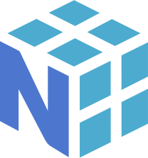

### Hi there, I'm Victor Kich!

Hi, I'm Victor Kich, a believer that self study is the best way for the modern student learn new things. I really enjoy working with robotics, neural networks, reinforcement learning and computer graphics.

- 🔭 I’m currently working on [RiAE](https://github.com/victorkich/RiAE) and [ManyTor](https://github.com/victorkich/ManyTor)
- 🌱 I’m currently learning Deep Reinforcement Learning with [PyTorch](https://pytorch.org/)
- 📫 How to reach me: victorkich@yahoo.com.br
- 💬 Ask me about anything [here](https://github.com/victorkich/victorkich/issues)

<!-- - 👯 I’m looking to collaborate on ... -->
<!-- - 🤔 I’m looking for help with ... -->
<!-- - 😄 Pronouns: ... -->
<!-- - ⚡ Fun fact: ... -->

**Languages and Tools:**  

<!--  --> 

<code>

 
</code> 

