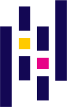

<h1 align="center">Hi there, I'm Victor Kich!</h1>
<h4 align="center">Hi, I'm Victor Kich, a believer that self-study is the best way for modern students to learn new things. I really enjoy working with robotics, generative deep learning, deep reinforcement learning, and computer graphics.</h4>

### Some of my features:

- 🔭 I’m currently working on [RiVAE](https://github.com/victorkich/RiVAE), [ManyTor](https://github.com/victorkich/ManyTor), [Jubileo](https://github.com/victorkich/jubileo)(private), and [Dibbuk Box](https://github.com/victorkich/Dibbuk-Box)(private)
- 🌱 I’m currently learning Deep Reinforcement Learning with [PyTorch](https://pytorch.org/), and Computer Graphics with [OpenGL](https://www.opengl.org/)
- 📫 How to reach me: victorkich@yahoo.com.br
- 💬 Ask me about anything [here](https://github.com/victorkich/victorkich/issues)

<!-- - 👯 I’m looking to collaborate on ... -->
<!-- - 🤔 I’m looking for help with ... -->
<!-- - 😄 Pronouns: ... -->
<!-- - ⚡ Fun fact: ... -->

<h4 align="center">Languages and Tools:</h4>

<!--  -->
<!--  -->

<code>

 

</code>

  

  

<h5 align="center">"Education isn't something you can finish". Asimov, Isaac.</h5>
